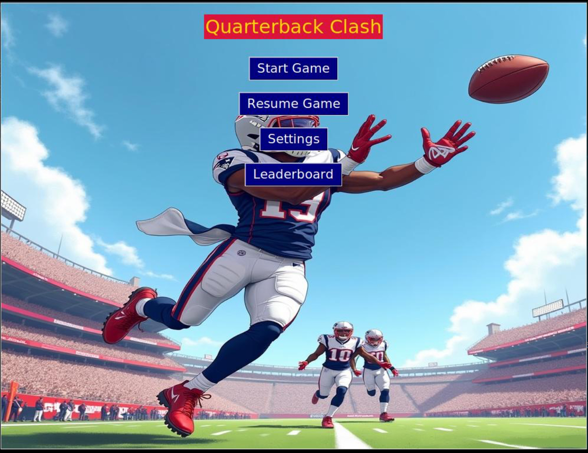
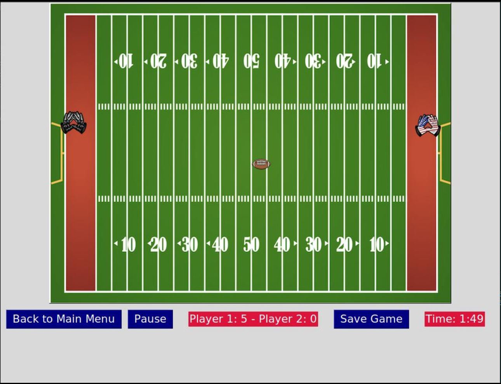

# 🏈 Quarterback Clash

**Quarterback Clash** is a football-themed twist on the classic Pong game — built using **Python** and **Tkinter**. Instead of paddles and a plain ball, you’ll take control of **receiver gloves** to rally a **spiraling football** across the screen in a fast-paced, reflex-driven arcade challenge.

With dynamic gameplay, quirky cheat keys, a leaderboard, and even a **boss key** to hide your screen from supervisors, this game blends fun mechanics with tongue-in-cheek design.

---

## 🎮 Features

- 🧤 **Football-Themed Gameplay**  
  Swap boring paddles for **receiver gloves** and bounce a **football** back and forth on the field.

- ⏱️ **Dynamic Difficulty**  
  The football **increases in speed** the longer the match goes on, testing your reflexes.

- 🎛️ **Customizable Controls**  
  Adjust movement keys for both players to suit your preferences.

- 🧠 **Cheat Keys for Debugging (or Mischief)**
  - `1` → Add a point to **Left Player**
  - `2` → Add a point to **Right Player**
  - `3` → **Slow down** the ball temporarily
  - `4` → Spawn a **midfield wall**, keeping the ball in one half

- 💼 **Boss Key Gimmick**  
  Press the **boss key** to instantly hide the game and show a **Forex trading chart** — perfect for pretending to work 😅

- 🕹️ **Pause, Save & Resume**  
  - Pause the game at any time  
  - **Save your progress** and **resume later** from where you left off

- 🏆 **Leaderboard System**  
  The winning player is prompted to enter their name, and the game **automatically stores** the score to a persistent leaderboard file.

---

## 🛠️ Tech Stack

- **Python 3.x**
- **Tkinter** (for GUI)

> No external dependencies required — runs out of the box with standard Python.

## 🙌 Why I Built This Game
As a computer science student at the University of Manchester and a proud member of the UoM American Football Team (Defensive Line 🛡️), I wanted to combine my love for the game with my passion for programming.

Quarterback Clash started as a fun way to reimagine a classic like Pong — but it turned into a creative exercise in adding modern features like save/resume, persistent leaderboards, and even a cheeky boss key. This project helped me deepen my Python GUI and file handling skills while having a blast in the process.
